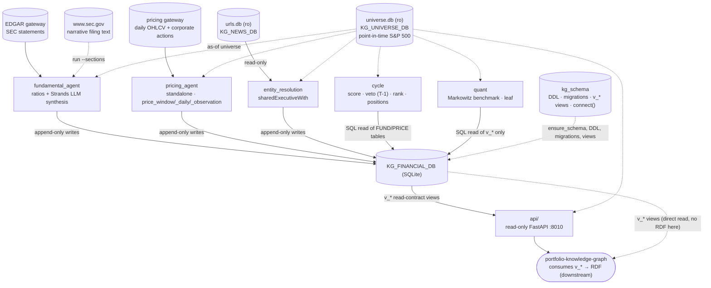

# SPEC.md — `portfolio-financial-analysis`

Part of the thesis *"Sistema inteligente para la optimización de la inversión
en portafolios mediante integración de información financiera estructurada y
no estructurada de acciones del S&P500"* — Gabriel Jaime Múnera González &
Dovaribi Carupia Yagari, Universidad Pontificia Bolivariana (UPB). Referred
to elsewhere in this document and the architecture artifacts by its working
nickname, "Portfolio Thesis."

The technical contract for this repository: requirements, architecture, data
model, and acceptance criteria. Where `.specify/memory/constitution.md` is
the philosophy/principles/code-style layer this repo commits to regardless of
feature, this document is the "what, precisely" layer for the system it
implements — every requirement below should be traceable to a test, and every
design decision should be explainable by a principle in the constitution.
Link liberally: a design choice justified by, e.g., the constitution's
Technological stock or AI behavior principles is annotated `(constitution: …)`
below rather than re-argued here.

Requirement IDs (`FR-0xx` functional, `NR-0xx` non-functional) are stable —
don't renumber an existing one, even if it's later superseded; mark it
superseded in place instead. Reference them in commits/PRs/tests
(`test_rundate.py::test_no_lookahead  # NR-001`) so a reviewer can trace
implementation back to requirement and requirement back to test.

---

## 1. Overview & Purpose

`portfolio-financial-analysis` is the analytical/reasoning core of a
six-repository system (the "Portfolio Thesis") that builds and maintains an
S&P 500 portfolio on top of a knowledge graph. Data flows in one direction
through the system:

```
sources (Wikipedia/news/Finnhub/SEC EDGAR)
  → portfolio-data-mining      (acquisition: discovers URLs, extracts article text)
  → portfolio-nlp              (semantic layer: sentiment, entities, category, summaries)
  → portfolio-financial-analysis (THIS REPO — fundamentals/pricing/cycle/quant → scores)
  → portfolio-knowledge-graph   (RDF/OWL projection + SPARQL evidence surface)
  → portfolio-reports           (as-of run engine, per-name evidence, HTML report)
  → portfolio-app                (thin Streamlit client)
```

with one feedback edge running back up (a user-defined decision criterion,
compiled once in `reports` and propagated into `financial-analysis` and the
knowledge graph) — out of scope for this repo, noted here only for context.

**What this repo is for**: raw EDGAR filings, daily pricing bars, and a
point-in-time S&P 500 universe are not usable as portfolio-decision inputs on
their own. `portfolio-financial-analysis` turns them into structured,
per-asset scores and a rule-driven veto/ranking lane — deterministic ratio
analysis over SEC filings (`fundamental_agent`), a pricing collector
(`pricing_agent`), cross-sectional TECHNICAL/VALORIZATION/SECTOR scoring and
selection cycles with a T-1 contagion-lagged veto (`cycle`), shared-executive
entity edges from news co-occurrence (`entity_resolution`), and a Markowitz
mean-variance benchmark to grade the blended-score book against (`quant`) —
with per-row provenance (`run_id`, `as_of`, `code_version`) and a shared,
passive schema (`kg_schema`) so everything downstream (the knowledge-graph
repo, via `v_*` views; `portfolio-reports`/`portfolio-app`, via the read-only
`api/` package) can treat the result tables as a stable, auditable contract
rather than re-deriving meaning from raw filings/prices/news itself.

**What this repo is explicitly not**: it does not discover URLs, crawl pages,
or extract article text (`portfolio-data-mining`'s job); it does not compute
per-article NLP signals — sentiment, NER, category (`portfolio-nlp`'s job —
this repo consumes only the resulting `article_sentiment`/`article_category`
tables, and even that SEMANTIC aggregation is moving to be owned by
`portfolio-nlp` itself, see §13); it never emits RDF or performs SHACL
validation (`portfolio-knowledge-graph`'s job — this repo's `v_*` views are
what that repo reads); it renders no report or UI
(`portfolio-reports`/`portfolio-app`'s job); it makes no final portfolio or
trading decision — its outputs are scored, ranked, and veto-flagged inputs to
that downstream decision.

## 2. Scope & Requirements

### 2.1 In scope

- Six analysis packages over a shared `KG_FINANCIAL_DB`: `fundamental_agent`,
  `pricing_agent`, `cycle`, `entity_resolution`, `quant`, and the passive
  shared schema `kg_schema`, each idempotent/resumable and each taking an
  `--analysis-date` that bounds ingestion to a point-in-time as-of date.
- A point-in-time S&P 500 universe read from a companion `universe.db`
  (read-only), plus a `coverage` command reporting which as-of members
  actually have core data.
- A read-only FastAPI serving layer (`api/`) over the `v_*` read-contract
  views and `universe.db`.
- A rule-driven veto lane (`rule_catalog` → `veto`) with a T-1 contagion lag,
  and a Markowitz mean-variance benchmark book (`quant`) to grade the
  blended-score portfolio against.

### 2.2 Out of scope

- URL discovery / page crawling / article extraction (`portfolio-data-mining`).
- Per-article NLP signal computation — sentiment, NER, category, summaries
  (`portfolio-nlp`); this repo consumes NLP output, it doesn't produce it.
- RDF/OWL projection, SHACL validation, named-graph minting
  (`portfolio-knowledge-graph`) — this repo emits no RDF itself, only the
  `v_*` relational read contract that repo consumes.
- Report rendering or any UI (`portfolio-reports`, `portfolio-app`).
- Cross-module orchestration of this repo's own packages into one sequenced
  run (`pricing` → `fundamental` → `entity_resolution` → `cycle` → `quant`
  is sequenced by hand today — see §13).

### 2.3 Functional requirements

| ID | Requirement | Acceptance criteria |
|---|---|---|
| **FR-001** | `fundamental_agent` pulls SEC 10-K/10-Q statements from the EDGAR gateway, computes deterministic ratios (profitability, liquidity, leverage, efficiency, growth, cash-flow, ROIC, CAGR, and — when a period-end price exists — valuation), and has a Strands metrics-master agent synthesize a `FundamentalAssessment` (0–100 score, bullish/neutral/bearish rating, narrative, strengths, risks), writing one immutable `score_snapshot[FUNDAMENTAL]` row per `(asset, form, fiscal_period)`. | A pipeline run on an unanalyzed filing writes exactly one `score_snapshot` row with `score_type='FUNDAMENTAL'` and one `fundamental_metrics` row; a re-run on the same `(asset, form, fiscal_period)` writes no new row (skip, not overwrite); `--analysis-date` caps the year range and skips filings with a `filing_date` after it. |
| **FR-002** | If the LLM synthesis call returns nothing usable (the current DeepSeek endpoint doesn't accept OpenAI `response_format` JSON-schema), `fundamental_agent` falls back to a rule-based score derived from the same computed ratios rather than leaving the row unwritten. | A test that forces the LLM call to fail/return unparseable output still produces a `score_snapshot[FUNDAMENTAL]` row with a non-null `score`/`rating` (constitution: AI behavior #2). |
| **FR-003** | `fundamental_agent run --sections` additionally fetches narrative filing sections (MD&A, risk factors) from `www.sec.gov` and writes `sec_filing_section` rows tagged with a canonical `item_label`. | A normal (non-`--sections`) run leaves `sec_filing_section` untouched; `--sections` populates it with `item_label` values matching the ontology's `itemLabel` token set (`v_sec_filing_section`'s SQL-built label matches `fundamental_agent.sections.canonical_item_label`). |
| **FR-004** | `pricing_agent` is standalone (no `fundamental_agent` coupling) and, per ticker, makes one gateway call over the requested date range, writing a `price_window` summary (return, daily-return std-dev, annualized volatility, trading days, min/max close, average volume); `--store-daily` additionally persists every OHLCV bar to `price_daily`, and `--observations` derives `price_observation` analytics (ATR, realized vol, drawdown, momentum). | `pricing_agent run` produces exactly one `price_window` row per requested ticker/range; re-running an unchanged range writes no duplicate row; `--analysis-date`'s fetch upper bound clamps `--end` and drops any candle dated after it. |
| **FR-005** | `cycle` computes TECHNICAL, VALORIZATION, and SECTOR `score_snapshot` rows from the agents' existing tables (read via plain SQL, no cross-package import), cross-sectionally normalizes each score type (`cross_sectional_z` + `z_to_score`, clamped to `[0, 100]`), and rolls per-sector TECHNICAL means into `sector_aggregate_snapshot`. | For a cycle run over a non-degenerate cohort, every present asset has a normalized `score_snapshot` row per computed score type in `[0, 100]`; a cohort of size 1 (degenerate z-score) does not raise, it returns a defined neutral value. |
| **FR-006** | `cycle` evaluates `rule_catalog` rules into `veto` rows with a **T-1 contagion lag**: a veto raised on cycle date `N` affects ranking only on `N+1` and later. Vetoes are cleared (`cleared_at` set), never deleted. | A veto row inserted for cycle date `N` does not exclude the asset from `cycle_ranking`/`portfolio_position` computed for date `N` itself, but does for the next cycle run at `N+1`; `hard_vetoed_as_of` never returns a row whose `cleared_at` predates the query cutoff as still active. |
| **FR-007** | `cycle select`/`monitor` blends the present score types by `score_weights` (default FUND .4 / VALOR .3 / TECH .2 / SEM .1, renormalized over whatever types are actually present), applies `soft_veto_penalty` per active SOFT veto, excludes T-1 HARD-vetoed assets, ranks the cohort into `cycle_ranking`, and (`select` only) writes `portfolio_position` targets bounded by `max_name_weight`/`max_sector_weight`. | A `select` run's `portfolio_position` rows respect `max_name_weight` (.10 default) and `max_sector_weight` (.30 default) as hard caps; a `monitor` run never writes `portfolio_position`; both are checkpointed via `cycle_run`/`cycle_checkpoint` and resumable — killing and re-running a cycle skips steps already marked `done`. |
| **FR-008** | `entity_resolution build` derives `sharedExecutiveWith` candidate edges from the data-mining repo's `urls.db` (news co-occurrence), reading it strictly read-only via `KG_NEWS_DB`. | `shared_executive_edge` rows are written only for pairs meeting `--min-weight`; no code path in `entity_resolution` opens `urls.db` for write; `--analysis-date` drives `cycle_run.cycle_date` and excludes news whose `pub_date` is after it or `NULL`. |
| **FR-009** | `quant` is a leaf package (imports only `kg_schema`; no other package imports `quant`) implementing a Markowitz mean-variance **benchmark** book, methodologically independent of the blended-score system: a dividend-folded total-return series, Ledoit-Wolf-shrunk covariance, an expected-return estimator (`equilibrium` default, `james_stein`, `hist_mean`), and five objectives (`min_var`, `risk_parity`, `tangency`, `target_vol`, `frontier`). | `tests/test_quant_import_isolation.py` passes (no non-`quant`/`api` module imports `numpy`/`scipy`/`cvxpy`); `quant`'s `liquidity_data_gate` output is provably unaffected by the presence/absence of `score_snapshot`/`cycle_ranking` rows (`tests/test_quant_gate.py`); each objective run persists a `quant_portfolio`/`quant_position` book plus its `quant_run` (`as_of`, `code_version`). |
| **FR-010** | `quant evaluate` computes forward realized and active return of a previously-optimized, frozen book against a chosen benchmark. | `quant_benchmark_performance` rows carry `portfolio_id`, `date`, and realized/active return figures for every date in the requested `--from`/`--to` window with sufficient forward price data; a date lacking forward data is skipped, not fabricated. |
| **FR-011** | `kg_schema` (vendored at `src/kg_schema/`, not an external dependency — see §3) is the single schema entrypoint every package calls from its own `ensure_schema`: additive `CREATE TABLE/INDEX IF NOT EXISTS` DDL plus nullable `ADD COLUMN`s run unconditionally and safely against the shared production DB; non-additive migrations (widening a `CHECK`, renaming a column's semantic value, promoting a table to a view) run only via an explicit `python -m <agent> migrate`, advancing a monotonic `schema_version` floor other repos can assert against. | `kg_schema.ensure(db)` run twice in a row is a no-op the second time (no error, no duplicate DDL effect); `python -m fundamental_agent migrate` run twice is idempotent (the second run applies zero migrations); `schema_version` only ever increases. |
| **FR-012** | Every agent takes an optional `--analysis-date YYYY-MM-DD` (default: today) that selects the S&P 500 universe point-in-time from `universe.db` as of that date (predicate `valid_from <= D AND (valid_to IS NULL OR valid_to > D)`), bounds ingestion so nothing dated after it is written, and is recorded on the run-log row (`analysis_run`/`pricing_run`/`quant_run`/`cycle_run`) alongside a `code_version` git tag. | For a fixed `--analysis-date D`, no row written by that run has an `event_time`/`filing_date`/`pub_date`/obs date after `D`, and no fundamental value it reads (`cycle`'s metrics, data-quality verdicts, FUNDAMENTAL scores, market caps; `quant`'s market caps) comes from a filing whose `available_at` — the first NYSE trading day after its `filing_date` — is after `D`, or that has none (T-106, T-107); every such row carries a non-null `available_at`, and no as-of reader filters them by `event_time`; the corresponding run-log row's `as_of` equals `D` and `code_version` is a non-empty git SHA/tag string. |
| **FR-013** | A `coverage` command (shared implementation in `kg_schema.cli`, exposed on `fundamental_agent`/`pricing_agent`/`quant`) reports, for the as-of universe, which members have core EDGAR/pricing/observation data, persisting one `universe_coverage` row per member; default behavior is warn (report + exit 0), `--strict` exits 1 below `--min-fraction`. | `python -m quant coverage --analysis-date D` upserts exactly one `universe_coverage` row per `(D, universe, symbol)`; `--strict` with `--min-fraction 1.0` against a universe with any uncovered member exits non-zero. |
| **FR-014** | `api/` exposes the `v_*` read-contract views and the point-in-time universe over HTTP (`/api/v1/health`, `/health/db`, `/runs`, `/universe`, `/universe/coverage`, `/scores`, `/portfolio/positions`, `/portfolio/ranking`), opening every database `mode=ro`, and never triggers an agent run itself. | Every `KG_FINANCIAL_DB`/`universe.db` connection opened by `api/` code is `mode=ro` (`grep` for a write-capable `connect(` call under `src/api/` returns none); a request against a view whose base table doesn't exist in a partial DB returns an empty list, not a `500`. |

### 2.4 Non-functional requirements

| ID | Requirement | Acceptance criteria |
|---|---|---|
| **NR-001** | No lookahead: a source row (filing, price candle, news article, universe membership) dated after a run's `--analysis-date` must never be written or read as if current. | `tests/test_rundate.py` and the per-agent coverage/gate tests assert no written row's date column exceeds the run's `as_of`; a synthetic fixture with a future-dated filing/candle/article is excluded, not ingested. |
| **NR-002** | `quant`'s numeric dependencies (numpy, scipy, cvxpy, clarabel) never load on any other package's import path. | `tests/test_quant_import_isolation.py` is green — importing `fundamental_agent`, `pricing_agent`, `cycle`, `entity_resolution`, `api`, or `kg_schema` does not import `numpy`/`scipy`/`cvxpy`. |
| **NR-003** | Every package connects to `KG_FINANCIAL_DB` through one shared convention (`kg_schema.db.connect`/`connect_ro`, itself wrapping `portfolio_common.db.Database`): `foreign_keys=ON`, a reapplied `busy_timeout`, and **no WAL** (the DB may sit on a bind mount with unreliable `-shm` support); `universe.db`/`urls.db` are opened `read_only=True`. | `grep -rn "PRAGMA journal_mode=WAL"` returns nothing under `src/`; every non-test `sqlite3`/`Database` connection to `KG_FINANCIAL_DB` in `src/` goes through `kg_schema.db.connect`, not a bare driver call. |
| **NR-004** | A DB-engine-contract change happens only through `portfolio-common`'s DB-engine-only surface (`Database`/`Dialect`/`in_clause`/`Allowlist`), git-tag-pinned in `[tool.uv.sources]` — never a floating version, and never a second SQL driver imported directly. As of the `v1.2.1` re-pin, no non-test module under `src/` imports `sqlite3`. | `grep -rn "import sqlite3" src` (excluding tests) returns nothing; `pyproject.toml`'s `portfolio-common` source is a `git`+`tag` pin (currently `v1.2.1`), not a bare version range; a remaining SQLite-specific fragment (DDL dialect, `INSERT OR IGNORE`/`ON CONFLICT`, `json_extract`/`json_each`) is SQL text routed through `conn.dialect.*`, not a driver import. |
| **NR-005** | The `api/` package degrades gracefully, never with a server error, when the underlying schema is partial (a package's tables/views haven't been created yet in a fresh or single-agent DB). | A request to any `/api/v1/*` endpoint against a `KG_FINANCIAL_DB` missing the queried view's base table returns `200` with an empty result, not `500` (`kg_schema.views.ensure_views` already drops a view whose base table is absent; `api/` must not assume the view exists). |
| **NR-006** | The hermetic test suite requires no live network access to the EDGAR gateway, the pricing gateway, `www.sec.gov`, or the LLM endpoint. | `uv run pytest` passes with `tests/fixtures/*.json` (real, captured EDGAR responses) and monkeypatched HTTP/LLM clients standing in for every external call — no test opens a live socket. |
| **NR-007** | Every write to a measurement/versioned table is append-only with a re-run collision on the same `*_version`/natural key silently skipped, not overwritten in place. | `quant_return_daily` (`engine_version`), `price_observation` (`engine_version`), `corporate_action` (`engine_version`) all use `INSERT OR IGNORE`/`UNIQUE`-constrained upserts; re-running the same command twice with the same engine version produces zero new/changed rows the second time. |

## 3. Technology Stack & Architecture Decisions

Full stack and rationale: `.specify/memory/constitution.md` §Technological
stock. Summary for traceability:

- **Runtime**: Python `>=3.12,<3.13`, `uv`-managed (`uv.lock` committed).
- **Analytical core**: deterministic ratio/statistics code across every
  package, plus one narrow LLM step — a Strands metrics-master agent in
  `fundamental_agent` that synthesizes a narrative assessment over
  already-computed ratios. No trained model, no `transformers`/`torch`.
- **Numeric leaf**: `quant`'s Markowitz benchmark (numpy/scipy/cvxpy/
  clarabel) — the repo's only heavy numeric dependency, import-isolated.
- **Serving**: FastAPI + `uvicorn`, read-only, `pydantic` request/response
  models; `httpx` for the EDGAR/pricing gateway calls.
- **Storage**: SQLite, one shared `KG_FINANCIAL_DB` via `kg_schema.db`
  (wrapping git-tag-pinned `portfolio_common.db.Database`, `v1.2.1`) — no raw
  `sqlite3` driver usage outside that seam (NR-004); the remaining
  SQLite-specific SQL (DDL dialect, `INSERT OR IGNORE`/`ON CONFLICT`, `json_*`
  in views) is routed through `portfolio_common.db`'s `Dialect`, not a driver
  import.

Architecture decisions this repo has already made and should not be
re-litigated without a constitution amendment:

- **The domain schema is vendored, not a dependency.** `src/kg_schema/`
  owns DDL/migrations/views/provenance/universe-reads/coverage directly;
  `portfolio-common` supplies only the engine-agnostic `Database`/`Dialect`/
  `in_clause`/`Allowlist` primitives underneath it. (History: this schema
  lived in `portfolio_common.kg_schema` before `portfolio-common`'s v1.0.0
  DB-engine/business-logic split pushed it back here — see
  `docs/portfolio-common-v1-migration-plan.md` — and the v1.2.1 re-pin then
  removed every non-test `import sqlite3` from `src/`, routing what stays
  SQLite-flavoured through `conn.dialect.*` instead — see
  `docs/portfolio-common-v1.2-engine-agnostic.md`.)
- **`pricing_agent` has zero imports to/from `fundamental_agent`.** Both are
  standalone; `cycle`/`entity_resolution` sit above them and read their
  tables via plain SQL, never by importing the producing package.
- **`quant` is a leaf, not a dependency of anything.** It reads shared
  tables/views via plain SQL and imports only `kg_schema`, so its numeric
  stack never loads on another package's import path (FR-009, NR-002); its
  universe/liquidity gate is deliberately blind to `score_snapshot`/
  `cycle_ranking` so the benchmark stays an independent control.
- **The universe is read point-in-time from an external `universe.db`, not
  frozen locally.** `universe_membership`/`v_universe_membership` in this
  repo's own DB are frozen (no longer written); every agent resolves its
  as-of cohort from the data-mining repo's `universe.db` instead (FR-012).
- **This repo emits no RDF.** It produces rich, append-only, provenance-
  tagged relational rows and a set of `v_*` read-contract views;
  `portfolio-knowledge-graph` owns triple emission, SHACL validation, and
  named-graph minting from those views.

## 4. System Architecture



**Reading this diagram**: `fundamental_agent` and `pricing_agent` are
independent (no cross-import); `cycle` sits above both, reading their tables
by plain SQL; `quant` is deliberately isolated — it touches only `kg_schema`
and the `v_*` views, so numpy/cvxpy never load on the agents' import path.
Every agent takes `--analysis-date` and resolves its as-of cohort from
`universe.db`; `kg_schema` is the one shared schema/connection seam every
package calls into. The `v_*` views are the one contract
`portfolio-knowledge-graph` depends on; everything behind them can change,
and the read-only `api/` serves those same views over HTTP for
`portfolio-reports`/`portfolio-app`.

Full detail, with hover tooltips per component, the shipped/partial/critical
status of each piece, and the gap/plan lists this document's §13/`PLAN.md`
draw from: [the repository
artifact](https://claude.ai/code/artifact/bfc6efde-aecd-4408-83b8-081bc3abccb0).
System-level placement of this repo among the other five: [the architecture
overview](https://claude.ai/code/artifact/d3865a63-2894-4e20-b38a-7e50cf0d4040).

## 5. Data Model

Canonical DDL: `src/kg_schema/ddl.py` (`ADDITIVE_DDL`, `REQUIRED_COLUMNS`).
Every table below lives in the one shared `KG_FINANCIAL_DB`; `assets` /
`sectors` are identity tables created only if missing (never overwritten) and
are not owned by any single package.

| Table | Key | Notable columns | Written by |
|---|---|---|---|
| `score_snapshot` | `UNIQUE(asset_id, score_type, event_time)` | `score_type ∈ {FUNDAMENTAL, VALORIZATION, TECHNICAL, SEMANTIC, SECTOR}`, `raw_value`, `normalized_score`, nullable `forensic_flags_json` (T-041); `event_time` is what the score is *about* (FUNDAMENTAL: the period end); `available_at` (FUNDAMENTAL only, required, T-107) is when it became usable — its filing's | `fundamental_agent`, `cycle`, (SEMANTIC: external — see §13) |
| `fundamental_metrics` / `financial_facts` | `UNIQUE(..., engine_version)` | per-group ratio outputs, each with its filing's required `available_at` (T-107); raw EDGAR facts with `event_time`/`ingested_at`/`filing_version` | `fundamental_agent` |
| `sec_filing_section` | `UNIQUE(filing_id, section_type, ordinal, engine_version)` | narrative text, `item_label` (ontology `itemLabel` token) | `fundamental_agent run --sections` |
| `price_window` / `price_daily` | natural key per ticker/range; `price_daily` per bar | return, daily-return std-dev, annualized vol; OHLCV | `pricing_agent` |
| `price_observation` | `UNIQUE(asset_id, obs_date, engine_version)` | ATR, realized vol, drawdown, momentum | `pricing_agent run --observations` |
| `rule_catalog` | `rule_id` PK | veto rule definition (metric/operator/threshold) | `cycle` (`seed_catalog`) |
| `data_quality_issue` | `UNIQUE(filing_id, metric_group, metric_name, metric_engine_version, rule_id, gate_version)` | Ring-1 `DQ_*` gate hit: `severity` (HARD → `cycle` `DATA_QUALITY` veto), `quarantined` (metric read as NULL), gated value | `fundamental_agent` (per filing + `quality` backfill) |
| `veto` | `UNIQUE(asset_id, rule_id, cycle_date)` | `severity` (HARD/SOFT), `cleared_at` (cleared, never deleted) | `cycle` |
| `portfolio_position` | `UNIQUE(asset_id, valid_from)` | position stints, weight | `cycle select` |
| `cycle_ranking` | `UNIQUE(cycle_run_id, asset_id)` | ranked cohort of a cycle | `cycle` |
| `cycle_run` / `cycle_checkpoint` | `UNIQUE(cycle_type, cycle_date)` / `UNIQUE(cycle_run_id, step)` | orchestrator provenance + resume | `cycle` |
| `sector_aggregate_snapshot` | `UNIQUE(sector_id, cycle_date, metric_type)` | per-cycle GICS-sector roll-up of members' TECHNICAL score | `cycle` |
| `shared_executive_edge` | `UNIQUE(asset_id_a, asset_id_b, person_name, method)` | `sharedExecutiveWith` candidate | `entity_resolution build` |
| `media_cooccurrence` | `UNIQUE(asset_id_a, asset_id_b, person_name, method)` | `shared_executive_edge`'s shape for non-executive (press/analyst) co-occurrence (T-043) | `entity_resolution build` (once T-082 lands) |
| `universe_membership` | `UNIQUE(asset_id, universe, valid_from)` | **frozen** — superseded by `universe.db` | not on any write path |
| `universe_coverage` | `UNIQUE(as_of, universe, symbol)` | per-member core-data coverage for a dated universe | `coverage` command |
| `corporate_action` | `UNIQUE(asset_id, action_type, ex_date, engine_version)` | dividends/splits (pricing gateway only; legacy XBRL-derived rows remain as history, unread) | `quant backfill-actions` |
| `quant_return_daily` | `UNIQUE(asset_id, obs_date, engine_version)` | total-return daily series, dividend-folded | `quant build-returns` |
| `risk_free_rate` / `benchmark_series` | `UNIQUE(curve, rate_date, engine_version)` / `UNIQUE(benchmark, obs_date, engine_version)` | rf curve + benchmark index | `quant` |
| `quant_risk_model` / `quant_expected_return` / `quant_covariance` | `UNIQUE(as_of, model_version)` / … | Markowitz μ / Σ per as-of model; `model_version` carries the run's input-manifest tag (T-090) | `quant build-risk-model` |
| `quant_portfolio` / `quant_position` / `quant_frontier_point` | `UNIQUE(as_of, kind, frontier_k, engine_version)` / … | optimized benchmark books + frontier | `quant optimize` |
| `quant_benchmark_performance` | `UNIQUE(portfolio_id, date, engine_version)` | forward realized/active return of a frozen book | `quant evaluate` |
| `analysis_run` / `analysis_run_error`, `pricing_run` / `pricing_run_error`, `quant_run`, `cycle_run` | run PK | `run_id`, `as_of`, `code_version`, params, status | every agent |

**Read-contract `v_*` views** (documented in `src/kg_schema/views.py`) are
what `portfolio-knowledge-graph` consumes — the physical schema above can
evolve underneath them: `v_score_snapshot`, `v_sector`, `v_industry`,
`v_price_observation`, `v_sec_filing`, `v_sec_filing_section`, `v_veto`,
`v_rule_catalog`, `v_data_quality_issue`, `v_portfolio_position`, `v_shared_executive_edge`,
`v_cycle_ranking`, `v_weight_scheme`, `v_weight_component`,
`v_sector_aggregate_snapshot`, the `quant`-side `v_quant_*`/`v_corporate_
action`/`v_risk_free_rate`/`v_benchmark_series`/`v_quant_vs_live`, and the
run-log views `v_analysis_run`/`v_pricing_run`/`v_quant_run`/`v_cycle_run`/
`v_universe_coverage`. `v_universe_membership` is **frozen** — downstream
readers should move to `universe.db`/`kg_schema.queries` instead.

**Non-additive migrations** (`src/kg_schema/migrations.py`, `m001`–`m008`)
advance a monotonic `schema_version` floor other repos can assert against —
notably `m004` folded the legacy `fundamental_snapshot` table into
`score_snapshot[FUNDAMENTAL]` behind a compatibility view, and `m006` renamed
`score_type='QUANTITATIVE'` to `'VALORIZATION'` everywhere it's persisted
(the CHECK, stored rows, and `cycle_run.params_json`/`cycle_ranking.
components_json` keys), and `m008` backfilled `available_at` on `sec_filings`,
`fundamental_metrics` and FUNDAMENTAL scores and put its guards in place (T-107).
Full detail: `docs/kg_schema.md`.

## 6. Core Workflows

**Fundamental analysis** (`fundamental_agent run`): pull EDGAR statements for
the as-of universe → compute deterministic ratios per group → the Strands
metrics-master agent consults specialists over those ratios (or a rule-based
fallback if the LLM call fails) → write one `score_snapshot[FUNDAMENTAL]` +
`fundamental_metrics` row per `(asset, form, fiscal_period)`, skipping
filings already analyzed; `--sections` additionally fetches and stores
narrative filing text from `www.sec.gov`.

**Pricing collection** (`pricing_agent run`): for each as-of-universe ticker,
one gateway call over the requested range → a `price_window` summary;
`--store-daily`/`--observations` add `price_daily`/`price_observation`.
Standalone — no dependency on `fundamental_agent`'s output.

**Selection/monitoring cycle** (`cycle select`/`monitor`): read the agents'
existing tables via plain SQL → compute TECHNICAL/VALORIZATION/SECTOR
`score_snapshot` rows → cross-sectionally normalize → evaluate
`rule_catalog` into `veto` rows (T-1 lag) → blend present score types →
rank into `cycle_ranking` → (`select` only) derive `portfolio_position`
targets. Checkpointed via `cycle_run`/`cycle_checkpoint` so a killed run
resumes from the last completed step rather than restarting.

**Entity resolution** (`entity_resolution build`): read the news repo's
`urls.db` (`KG_NEWS_DB`, strictly read-only) → derive `sharedExecutiveWith`
candidate edges from executive co-occurrence above `--min-weight`.

**Quant benchmark** (`quant backfill-actions` → `build-returns` →
`build-risk-model` → `optimize` → `evaluate`): pull corporate actions from the
pricing gateway (the only source; a gateway that cannot serve fails the run)
→ build a dividend-folded total-return series → gate the universe on
liquidity/history/T-1-hard-veto (score-blind) → estimate Σ (Ledoit-Wolf) and
μ (equilibrium/James-Stein/hist_mean) → optimize one or more objectives →
persist the book → later, evaluate its forward realized/active return
against a chosen benchmark.

**Coverage check** (`fundamental_agent`/`pricing_agent`/`quant coverage`): a
standalone, read-only pre-run check reporting which as-of universe members
have core EDGAR/pricing/observation data, persisted to `universe_coverage`.

**Serving** (`api/`, no write access): a request opens `KG_FINANCIAL_DB`/
`universe.db` `mode=ro` and reads the `v_*` views / point-in-time universe
directly — it never triggers an agent run; that stays `portfolio-reports`'
job.

## 7. Business Logic & Algorithms

- **Fundamental ratios** are plain, code-computed arithmetic over EDGAR
  facts (profitability, liquidity, leverage, efficiency, growth, cash-flow,
  ROIC, CAGR); **valuation** (equity/enterprise FCF yield, an SBC-adjusted
  variant, market cap, enterprise value) additionally needs a period-end
  market price — it reads the latest `price_daily` close on or before the
  filing's period-end with a plain `SELECT` (no import of `pricing_agent`);
  without price rows the group is silently skipped and every other metric is
  unaffected. Individual ratio specifications are documented per-skill under
  `skills/<ratio>/SKILL.md` (`roic`, `cagr`, `fcf_margin`,
  `free_cash_flow_yield`, `interest_coverage_ratio`).
- **LLM synthesis** (`fundamental_agent`'s Strands metrics-master) consumes
  only the already-computed ratios, never raw filing text, to produce the
  narrative `FundamentalAssessment` — the LLM cannot see anything the
  deterministic layer didn't already compute (constitution: AI behavior #1).
  It parses a JSON reply rather than using `Agent.structured_output` because
  the current DeepSeek endpoint doesn't accept OpenAI `response_format`
  json-schema; a rule-based score derived from the same ratios is the
  fallback when that parse fails (constitution: AI behavior #2).
- **Cross-sectional normalization** (`cycle.scores.normalize`):
  `cross_sectional_z` winsorizes (2% by default) then z-scores against the
  live cohort (returns zeros for a degenerate/size-1 cohort rather than
  raising); `z_to_score` maps `z` to `clamp(50 + 10z, 0, 100)`.
- **TECHNICAL score**: a weighted blend of cross-sectionally ranked
  sub-signals — `momentum_63d` (.35, higher better), `momentum_21d` (.15,
  higher better), `realized_vol_90d` (.20, lower better), `atr_14/close`
  (.15, lower better), `max_drawdown_90d` (.15, less-negative better) — a
  documented-as-provisional definition (`docs/cycle.md`), open to
  refinement.
- **Veto evaluation**: every rule in `rule_catalog` is currently a single
  flat threshold comparison (`param_metric`/`param_operator`/
  `param_threshold`), not an AND/OR clause tree — a simplification versus
  the system ontology's `RuleClause` (see §13). A HARD veto excludes an
  asset from selection as of the day *after* it fires (T-1 contagion lag);
  a SOFT veto subtracts `soft_veto_penalty` (15 pts default) from the
  blended score instead of excluding.
- **Portfolio blend**: `score_weights` (FUND .4 / VALOR .3 / TECH .2 / SEM
  .1 by default) are renormalized over whichever score types are actually
  present for an asset before blending — a name missing SEMANTIC (today,
  effectively every name — see §13) is not silently scored 10% lower, its
  remaining weights absorb that share.
- **Markowitz benchmark** (`quant`): Ledoit-Wolf (2004) linear-shrinkage
  covariance toward a constant-correlation target, always symmetrized and
  eigenvalue-floored before the optimizer sees it; expected returns from one
  of `equilibrium` (reverse-optimized from cap weights — the default,
  because it carries real cross-sectional dispersion with near-zero
  estimation noise), `james_stein`, or `hist_mean` (both of which, over ~5y
  of daily data, shrink toward a flat mean and collapse the frontier onto
  `min_var` — see §13's critical gap). The universe/liquidity gate reads no
  score/ranking data, keeping the benchmark an independent control
  (`tests/test_quant_gate.py`).
- **Total-return construction**: `tr_log_return_t = ln((C_t + D_t) /
  C_{t-1})`, dividends sourced **only** from the pricing gateway
  (`corpact-v1`; `portfolio-data-mining`'s yfinance-backed
  `GET /pricing/{ticker}/actions`) — `quant` mines nothing itself and has no
  filing-derived fallback, so a gateway that cannot serve fails
  `backfill-actions` rather than degrading (see §13 and `PLAN.md` Work item 10).

## 8. Error Handling & Resilience

Governing principle: **fail loudly for structural problems, log-and-skip for
per-item data gaps that don't invalidate the rest of the run**. Concretely:

- A missing/empty universe resolution (`active_universe`/
  `load_universe_asset_ids` finding nothing for the as-of date) raises
  loudly rather than silently falling back to "all assets" — the silent
  fallback that used to exist in `quant` has been removed.
- Per-ticker/per-filing failures (a dead ticker, an unparseable filing) are
  recorded in `analysis_run_error`/`pricing_run_error` and do **not** stop
  the batch — a `tqdm` progress bar keeps running and the run completes with
  a partial result plus a visible error log, not a silent gap or a full
  abort.
- The `valuation` metrics group is skipped (not errored) when no
  period-end price row exists — every other metrics group is computed
  regardless.
- `coverage`'s default mode is **warn** (report + exit 0); only `--strict`
  turns an under-covered as-of universe into a hard failure — the intent is
  visibility by default, a CI/ops gate only when explicitly requested.
- `kg_schema.views.ensure_views` probes each view with a zero-row `SELECT`
  right after creation and drops it if its base table is absent in this
  (partial/single-agent) database — a package that hasn't run yet must not
  leave a dangling view that later breaks a migration's `ALTER TABLE …
  RENAME` re-parse.
- Non-additive migrations (`kg_schema.migrations`) each run inside one
  transaction, are guarded (check the table exists / columns are present /
  the migration hasn't already run), and record their version only on
  success — a partially-applied migration cannot silently masquerade as
  done.

## 9. Performance & Scalability Expectations

This repo has no throughput/latency SLA, and defining one is out of scope
(§14) — a real-time or high-volume performance target belongs to a
production system this project isn't. What is enforced by design:

- **Import isolation** (NR-002): `quant`'s numeric stack never loads outside
  `quant`/`api`'s own boot path, so the other five packages' cold-start cost
  is unaffected by numpy/scipy/cvxpy being installed.
- **Resumability over raw speed** (FR-006, FR-007): `cycle`'s checkpointed
  runner and every agent's skip-already-processed idempotency mean a slow or
  interrupted run costs wall-clock time on re-run, not correctness — no
  throughput number is asserted or needed for that guarantee to hold.
- **No articles/sec, filings/sec, or API-latency number is stated anywhere
  in this document** — none has been measured, and inventing one with no
  load test behind it would be worse than stating plainly that none exists
  (§14).

## 10. Testing Strategy & Acceptance Criteria

- **Hermetic by construction** (NR-006): `tests/conftest.py` and
  `tests/fixtures/*.json` (real, captured EDGAR gateway responses) build
  minimal SQLite fixtures and monkeypatch every outbound HTTP/LLM call — no
  test opens a live network socket.
- **Coverage mapping**: `test_kg_schema.py`/`test_kg_queries.py`/`test_db.py`
  exercise the shared schema/connection seam (FR-011, NR-003/NR-004);
  `test_pipeline.py`/`test_metrics*.py`/`test_statements.py`/
  `test_edgar_client.py`/`test_sections.py`/`test_provenance.py` cover
  `fundamental_agent` (FR-001/002/003); `test_pricing_*.py` covers
  `pricing_agent` (FR-004); `test_cycle.py` covers `cycle` (FR-005/006/007);
  `test_entity_resolution.py` covers `entity_resolution` (FR-008);
  `test_quant_*.py` (returns basis, LW covariance, objectives, optimize,
  panel, gate, import isolation, config, DDL, rates, state redaction) covers
  `quant` (FR-009/010, NR-002); `test_coverage.py`/`test_rundate.py` cover
  the point-in-time universe + `--analysis-date` contract (FR-012/013,
  NR-001); `test_api.py` covers `api/` (FR-014, NR-005); `test_skills.py`
  covers the `skills/*/SKILL.md` ratio specifications.
- **New requirement → new test first** (constitution: Code & Git #1's
  enforced-not-advisory spirit) — a change implementing or altering an
  FR/NR above should land with a test that references the requirement ID in
  a comment or test name.
- **Acceptance criteria in §2.3/§2.4 are the test spec** — each row should
  be directly expressible as one or more `pytest` assertions; a PR claiming
  to satisfy an FR/NR without a corresponding test is incomplete.
- **Structural tests are architecture tests, not feature tests**:
  `test_quant_import_isolation.py` failing means the leaf-package boundary
  (constitution: Technological stock #2) was violated, not that a feature
  regressed — treat it accordingly in review.

## 11. Deployment Procedures

There is no formal CD pipeline for this repo yet; what exists:

1. `uv sync --group dev`.
2. Configure `.env` (or real environment) with `KG_FINANCIAL_DB` (required
   by every package) and, as needed per package, `KG_UNIVERSE_DB` /
   `KG_NEWS_DB` / `LLM_API_KEY` / `LLM_MODEL` / `LLM_URL` /
   `EDGAR_BASE_URL` / `PRICING_BASE_URL` / `API_HOST` / `API_PORT` /
   `API_ROOT_PATH` — README.md's configuration table is the source of truth
   (no `.env.example` is committed today, see constitution: Project
   structure #6).
3. Run whichever package CLI the operator needs, in the order the data
   dependencies imply (`pricing_agent`/`fundamental_agent` first for
   `cycle`'s inputs, `cycle` before reading its output, `quant` any time
   after `pricing_agent` — no scheduler or orchestrator is wired in today,
   see §13) and/or run `uv run python -m api` as a long-lived read-only
   service.
4. CI gate before merge (`.github/workflows/ci.yml`, `master`/PRs): two
   parallel jobs — `quality` (`uv sync --frozen --group dev` → ruff check →
   ruff format --check → `pre-commit run --all-files`, which includes
   mypy) and `tests` (`uv sync --frozen --group dev` → `pytest -q`).

## 12. Dependencies & Integrations

- **Upstream (required, external services)**: an EDGAR gateway (SEC
  financial statements; `portfolio-data-mining`'s `sec_edgar` service) and a
  pricing gateway (daily OHLCV, and `quant`'s only source of dividends/splits;
  `portfolio-data-mining`'s pricing service),
  both defaulting to `host.docker.internal:8000`; `www.sec.gov` directly for
  `fundamental_agent run --sections`; an OpenAI-compatible LLM endpoint
  (`LLM_API_KEY`/`LLM_MODEL`/`LLM_URL`, today DeepSeek) for the metrics-
  master synthesis.
- **Upstream (required, read-only data)**: `universe.db` (`KG_UNIVERSE_DB`,
  `portfolio-data-mining`'s point-in-time S&P 500 membership — every agent's
  as-of universe source, FR-012); `urls.db` (`KG_NEWS_DB`,
  `portfolio-data-mining`'s news database, read only by `entity_resolution`
  for co-occurrence, FR-008); `portfolio-nlp`'s `article_sentiment`/
  `article_category` tables, today read directly by the integration repo for
  SEMANTIC scoring (moving — see §13).
- **Upstream (library)**: `portfolio-common`, git-tag-pinned in
  `pyproject.toml` (`[tool.uv.sources]`, currently `v1.2.1`) — DB-engine-only
  (`Database`/`Dialect`/`in_clause`/`Allowlist`); a re-pin is an explicit,
  reviewed change, never a floating version (NR-004). This repo is "Phase 4"
  of a six-repo engine-agnostic rollout tracked in `portfolio-nlp`'s
  `docs/engine-agnostic-rollout.md`; `portfolio-data-mining`'s Phase 5 is
  the one piece still outstanding system-wide.
- **Downstream (consumers, read-only via `v_*` views and/or `api/`)**:
  `portfolio-knowledge-graph` (RDF projection + SHACL validation, no RDF
  emitted here); `portfolio-reports`/`portfolio-app` (via the read-only
  `api/` package, a stable network boundary instead of opening the SQLite
  files directly).
- **No dependency on**: any repo downstream of this one
  (`knowledge-graph`, `reports`, `app` never call into this repo except
  through `v_*`/`api/`); `portfolio-data-mining` internals beyond the three
  seams above.

## 13. Open Questions & Risks

Carried forward from the last recorded architecture review
([the repository artifact](https://claude.ai/code/artifact/bfc6efde-aecd-4408-83b8-081bc3abccb0))
and this document's own drafting — resolve or explicitly accept before
treating a related FR/NR as done:

1. **`quant`'s μ has no cross-sectional signal** (critical). Expected
   returns estimated from ~5 years of daily data have a standard error far
   larger than the true cross-sectional spread, so both return-aware
   estimators (`james_stein`, `hist_mean`) collapse mean-variance to
   minimum-variance in practice; `equilibrium` is the accepted default
   precisely because it avoids this, but the frontier/`tangency`/
   `target_vol` objectives are not yet return-aware in a defensible sense.
   Not started.
2. **Survivorship bias — root cause fixed, residuals remain.** The universe
   is now read point-in-time from `universe.db` as of `--analysis-date`
   (this repo's own `universe_membership` is frozen), so a run gates to the
   constituents that were actually in the index then. Residual gaps:
   `price_daily` starts 2022 with no delisted-name backfill; EDGAR itself
   isn't point-in-time (restatements can leak into a historical read); and
   the fact/score store is keyed by `(asset, form, fiscal_period)` — not
   partitioned by `as_of` — so it cannot hold parallel point-in-time
   snapshots for the same filing read at two different dates. `coverage`
   flags as-of members with no core data but doesn't solve the underlying
   partitioning gap.
3. **No cross-module orchestrator.** `pricing_agent` → `fundamental_agent`
   → `entity_resolution` → `cycle` → `quant` are sequenced by hand today;
   there is no single `run --analysis-date D` that drives all five with
   checkpointing the way `cycle` itself is checkpointed internally.
4. **The SEMANTIC score is an external boundary, not yet cut over.** The
   schema accepts `score_snapshot[SEMANTIC]` and `cycle` already reads it
   (`latest_semantic_score`, weight `0.1`), but the per-`(asset, day)`
   aggregation from `portfolio-nlp`'s `article_sentiment`/`article_category`
   is designed, not built, in either repo — today the integration
   (knowledge-graph) repo is still the nominal writer, which this repo's own
   `docs/README.md` and `docs/semantic-score-boundary.md` both flag as a
   dependency cycle to remove (the proposed shape: `portfolio-nlp` computes
   and owns the signal, this repo reads it read-only via a new `KG_NLP_DB`
   and materializes its own `score_snapshot[SEMANTIC]` row, the
   knowledge-graph repo stops writing it). Full worry list, placement map,
   and open sub-questions: `docs/semantic-score-boundary.md`. Mitigation
   until cut over: keep the blend weight low/zero for names with no
   SEMANTIC row rather than treating its absence as a zero score.
5. **Dividends come only from the pricing gateway (live and verified 2026-09-21, `T-052`).**
   `quant` does not mine or derive corporate actions: acquiring data is
   `portfolio-data-mining`'s job, and its yfinance-backed
   `GET /pricing/{ticker}/actions` (that repo's `PLAN.md` Work item 3) is built
   and, as of 2026-09-21, deployed and verified from here (`T-052`): production
   `corporate_action` holds 7,481 gateway rows for all 503 assets. `build-returns`
   must follow a successful `backfill-actions` (a series built without
   dividends locks in as price-only); and since `T-086` (2026-09-21) it refuses to run otherwise. The consumer (`PLAN.md` Work item 10 / `T-085`) fails the
   run when the gateway cannot serve, and gives an asset the gateway cannot serve
   no rows. Upstream is yfinance: unofficial, no SLA, and it cannot tell an unknown
   symbol from a name that paid nothing. The retired XBRL-derived engines
   (`corpact-v0-approx`, `corpact-v1-derived`) left history in `corporate_action`
   that `quant` no longer reads. No vendor risk-free curve or index series is
   loaded yet either (the tables/CSV loaders exist, unpopulated).
6. **Vetoes are flat threshold rules, not an AND/OR clause tree.**
   `rule_catalog` has no analogue of the system ontology's `RuleClause`
   composite structure — every rule is a single leaf comparison (§7).
7. ~~The `portfolio-common` pin lags the artifact's recorded upstream
   state~~ — **resolved 2026-09-05, PR #32** (`refactor/engine-agnostic`,
   commit `8b1fd14`). `pyproject.toml` now pins `tag = "v1.2.1"`; every
   non-test `import sqlite3` under `src/` is gone (`sqlite3.Row` → the
   neutral `Row`, `except sqlite3.OperationalError` → `except
   DatabaseError`, `PRAGMA`/`sqlite_master` introspection →
   `table_columns`/`relation_exists`/`relation_ddl`, `executescript` →
   `create_schema`, the missing-columns loop → `ensure_columns`). What
   remains SQLite-flavoured (the DDL dialect, `INSERT OR IGNORE`/`ON
   CONFLICT ... DO UPDATE`, `json_extract`/`json_each` in the `v_*` views)
   is held as SQL text routed through `conn.dialect.*`, not a driver
   import — full record: `docs/portfolio-common-v1.2-engine-agnostic.md`.
   Kept here, struck through, only so the item number stays stable.
8. **`fundamental_agent`'s LLM synthesis has no accuracy measurement.**
   Unlike `portfolio-nlp`'s LLM-as-judge evaluation subsystem, there is no
   labelled or judged check on the metrics-master's narrative/rating quality
   — its correctness rests on the deterministic ratios underneath it plus
   the rule-based fallback (FR-002), not on a measured accuracy baseline.

## 14. Scope Boundaries (Out of Scope, Not Deferred)

**This repository is a thesis/research artifact. Productizing it is not a
goal of this project and no production phase is planned.** Every requirement
and acceptance criterion above (§2–§13) describes and governs that scope
honestly — nothing above should be read as an implicit production-readiness
claim. The items below are **permanently out of scope as this project is
currently defined**, not a backlog or a roadmap; they exist so a reader
doesn't mistake "not built" for "overlooked."

### What this stage validates

Per the design rationale in §7 and the acceptance criteria in §2.3/§2.4,
this repo currently validates:

- **Structural correctness** of the point-in-time universe contract (FR-012,
  NR-001 — no-lookahead is a tested guarantee, not an assumption) and of
  `quant`'s score-independence (FR-009, `tests/test_quant_gate.py`).
- **Idempotency/resumability** of every batch package and of `cycle`'s
  checkpointed runner (FR-006/007/013), exercised by the test suite (§10).
- **Import-graph isolation** of `quant`'s numeric stack (NR-002), enforced
  by a dedicated structural test rather than convention alone.
- **Deterministic-computation correctness** of the fundamental ratios and
  the Markowitz estimators (§7) — not the *quality* of the LLM narrative
  synthesis layered on top, which has no accuracy baseline (§13 item 8).

### What this project explicitly does not do (out of scope)

None of the following exist today, none are assumed by any FR/NR above, and
none are planned — this list is here so that absence reads as a deliberate
boundary of what this project is, not a gap someone forgot to close:

- **Access control**: the `api/` service has no authentication or
  authorization — every `/api/v1/*` endpoint is open to anyone who can reach
  it. Acceptable only because the service is expected to run on a
  private/trusted network with a single operator, not because it's been
  assessed as safe for broader exposure.
- **Operational tooling**: no monitoring/alerting, no on-call runbook, no
  documented disaster-recovery procedure for `KG_FINANCIAL_DB`, no scheduler
  or cross-module orchestrator (§13 item 3).
- **Throughput/latency SLAs and load testing** (§9) — a production
  requirement this project doesn't have.
- **A precise, vendor-sourced total-return/corporate-actions series, a
  factor-based μ estimator, and a `RuleClause`-style veto tree** (§13 items
  1/5/6) — accepted approximations at this scope, not oversights.

### §13 items: disposition

| §13 item | Disposition | Would only matter if |
|---|---|---|
| 1 — μ has no cross-sectional signal | **Open, critical** — the return-aware objectives are not yet defensible; see `PLAN.md` | Someone reads `tangency`/`frontier`/`target_vol` output as return-informed today |
| 2 — survivorship residuals | Root cause fixed (point-in-time universe); residuals accepted at current scope, tracked in `PLAN.md` | A historical replay needed pre-2022 delisted-name price history or point-in-time EDGAR |
| 3 — no cross-module orchestrator | Accepted for now, being actively worked (see `PLAN.md`) | Manual sequencing became error-prone at higher run frequency |
| 4 — SEMANTIC boundary uncut | Accepted, designed, not yet built — full plan in `docs/semantic-score-boundary.md` | The blend weight moves above the current placeholder or `portfolio-nlp` ships the aggregation stage |
| 5 — gateway-only dividends, no rf/index series | Closed for dividends: the consumer is `PLAN.md` Work item 10 / `T-085` (done), verified live by `T-052` (2026-09-21). rf/index series accepted as approximations | yfinance's accuracy mattered, or a symbol yfinance does not recognise paid a dividend (it returns a clean empty result) |
| 6 — flat veto rules | Accepted; sufficient for the current rule set | The rule set needed genuine AND/OR composition to express a policy |
| 7 — ~~`portfolio-common` pin lags upstream~~ | **Resolved (2026-09-05, PR #32)** — `v1.2.1` re-pin landed, no `import sqlite3` remains under `src/` | — |
| 8 — no LLM synthesis accuracy measurement | Accepted; the rule-based fallback and deterministic ratios are the load-bearing correctness guarantee, not the narrative | The narrative/rating output itself became a scored input rather than context |

## 15. Sign-off

This SPEC.md is the technical contract implementers, reviewers, and (per
`.specify/memory/constitution.md`'s AI behavior section) coding agents plan
against. A change that adds/removes a functional capability, alters an
acceptance criterion, or introduces a new external dependency should update
the relevant `FR-0xx`/`NR-0xx` entry (or add a new one) **in the same PR**
that implements it — not as a follow-up. A PR that contradicts this document
without amending it here first is out of spec; raise the conflict rather
than silently diverging (constitution: Governance).

| Role | Name | Date | Notes |
|---|---|---|---|
| Author | Gabriel Jaime Múnera González | | Universidad Pontificia Bolivariana (UPB) |
| Author | Dovaribi Carupia Yagari | | Universidad Pontificia Bolivariana (UPB) |
| Reviewer | Camilo Andrés Soto Montoya | | Universidad Pontificia Bolivariana (UPB) |

**Version**: 1.1.0 | **Last Amended**: 2026-09-12
